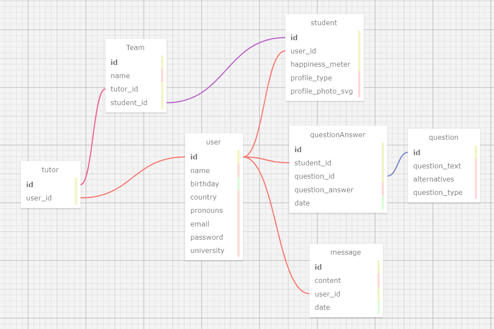

# Ponderada Semana 3 - Modelagem de Banco de Dados

- <strong>Nome do Projeto</strong>: C³ - Code Conecting Cultures
 - <strong>Descrição</strong>: Uma plataforma web, a qual será utilizada para gerir problemas culturais, diferenças de fuso horário e comunicação entre os membros dos grupos no jogo, por meio abas onde o usuário consegue acessar o perfil de cada integrante do seu grupo, e com isso entender o contexto que cada um vive, e também abas onde o usuário conseguirá avaliar o desempenho dos seus colegas de equipe.

 Segue abaixo o modelo relacional do banco de dados:

 

Modelo Relacional do Banco de Dados

Fonte: Material produzido pelo autor (2024)

